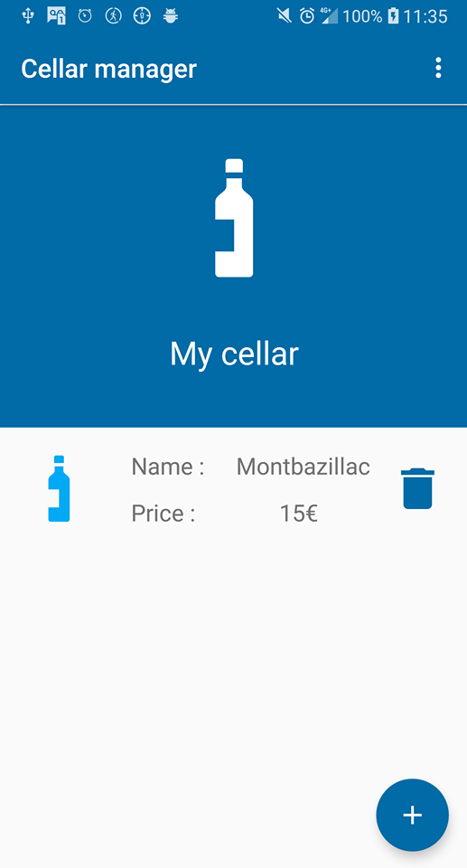
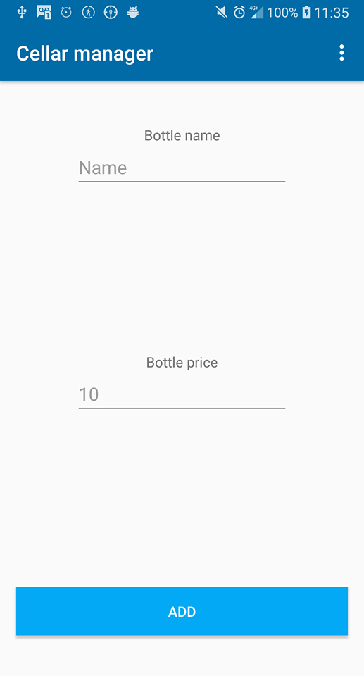

# cellar-app
This is the repository of a school project on android development. It is connected to [cellar-api](https://github.com/hugoseri/cellar-api) repository.   
The goal is to make a graphical interface to interact with the [cellar-api](https://github.com/hugoseri/cellar-api).

# App overview

  
  
   

