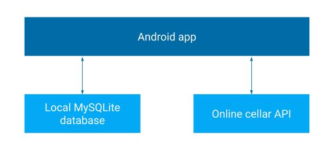

# Project
This is the repository of a school project on android development. It is connected to [cellar-api](https://github.com/hugoseri/cellar-api) repository.   
The goal is to make a graphical interface to interact with the [cellar-api](https://github.com/hugoseri/cellar-api).

# App overview
### Main page

  
   

In this page, you can see all the bottles added in the cellar from the [cellar-api](https://github.com/hugoseri/cellar-api) (when offline, it shows the bottles saved in the local database).   
You can easily add a bottle by using the button on the bottom-right corner of the screen.    
On the top-right corner, you have a menu and an option to delete all bottles in the cellar.

### Add a bottle page

  
   

In this page, you can easily add a new bottle to the cellar.
By doing this, it actually adds a bottle in the [cellar-api](https://github.com/hugoseri/cellar-api) using a POST request.
It adds it in the local database as well.

# Interactions architecture

  
   

The app actually interacts with the [cellar-api](https://github.com/hugoseri/cellar-api).
It also uses a local database using [Room](https://developer.android.com/jetpack/androidx/releases/room).
